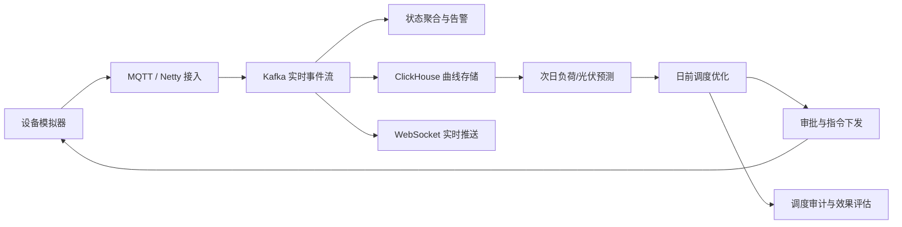

# 虚拟电厂与分布式能源调度平台

本目录是项目的启动规格包，目标是把光伏、储能和充电桩聚合成一个可观测、可预测、可调度、可审计的虚拟电厂（VPP）。

## MVP 产品闭环



## 规格索引

- [产品立项](docs/00-product-initiation.md)
- [产品需求文档（PRD）](docs/01-prd.md)
- [领域模型](docs/02-domain-model.md)
- [系统架构](docs/03-architecture.md)
- [事件与接口契约](docs/04-event-contracts.md)
- [数据模型](docs/05-data-model.md)
- [交付计划与任务清单](docs/06-delivery-plan.md)
- [实现交接提示词](docs/07-implementation-handoff.md)
- [实时控制台 UI 契约](docs/08-realtime-ui-contract.md)
- [告警中心契约](docs/09-alarm-center-contract.md)
- [日前预测中心契约](docs/10-forecast-center-contract.md)

## Phase 0 快速开始

```bash
cd vpp-platform
cp .env.example .env
npm install
make test-contract
make test-java
make compose-config
make infra-up
```

详细的基础设施说明见 [infra/README.md](infra/README.md)，契约演进规则见 [contracts/README.md](contracts/README.md)。

当前进度：T00、T02、T03、T04、T05、T06、T07 已达到 `runtime_verified`，T01 已达到 `contract_verified`；T08 日前预测与 T09 优化调度已通过算法、契约、PostgreSQL 集成和 UI 构建验证。T09 只生成经硬约束复核的候选计划，审批与下发由 T10 承接。运行说明见 [Platform API](apps/platform-api/README.md)、[Web Console](apps/web-console/README.md)、[设备模拟器](apps/device-simulator/README.md)、[IoT Gateway](apps/iot-gateway/README.md) 与 [Stream Processor](apps/stream-processor/README.md)。

## 默认技术基线

- Java 21、Spring Boot、Netty
- MQTT Broker（EMQX 或 Mosquitto）、Kafka
- PostgreSQL（控制面）、ClickHouse（遥测与分析）、Redis（短期状态）
- Python + FastAPI（T08 采用可解释的同类日基线；树模型待真实天气与样本条件具备后再验证引入）
- React/Next.js + ECharts（运营控制台）
- Docker Compose（本地与演示环境）

这些是启动假设，不是不可变决策。涉及供应商、部署环境和数据规模的选择，应在 Phase 0 结束前记录为 ADR。

## 成功标准

在单机 Docker Compose 演示环境中，至少 1,000 台模拟设备持续上报；运营人员能看到实时曲线和告警，生成次日 96 点预测与调度计划，审批后完成指令下发和回执，并通过审计日志还原一次调度的输入、决策、执行与效果。
