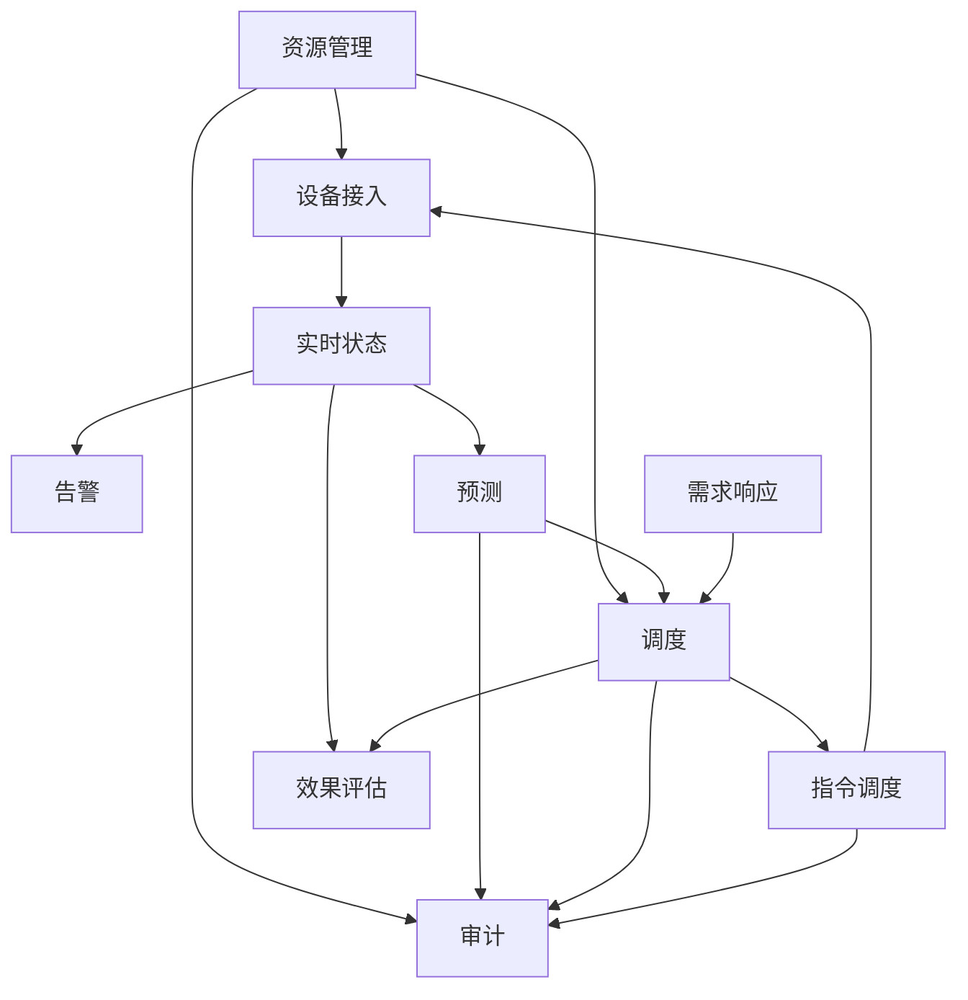
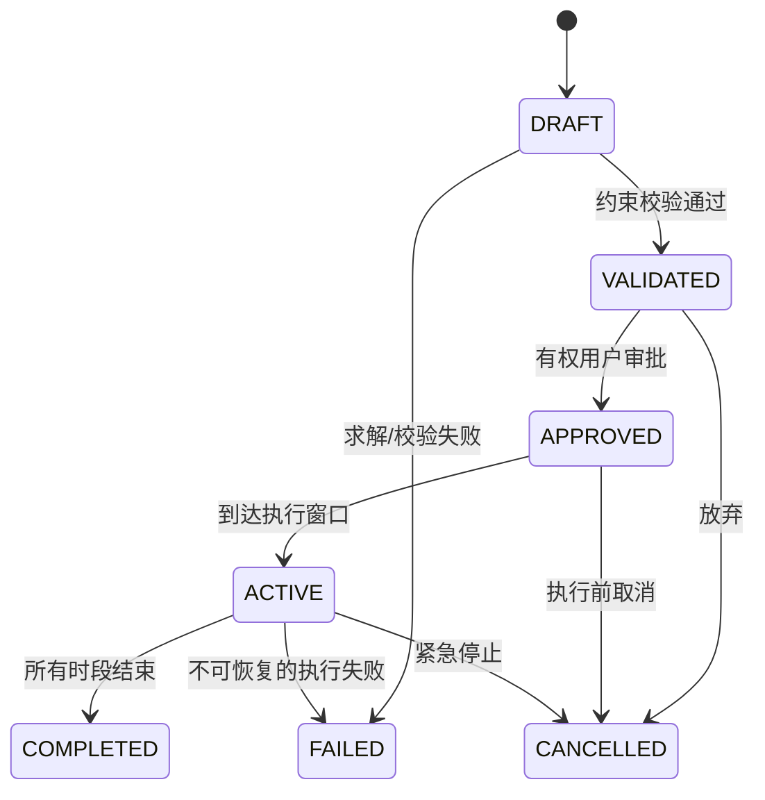
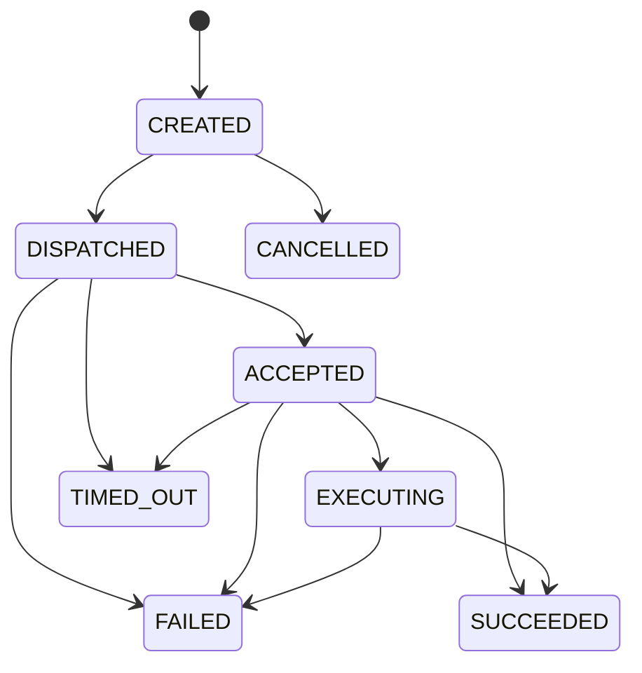
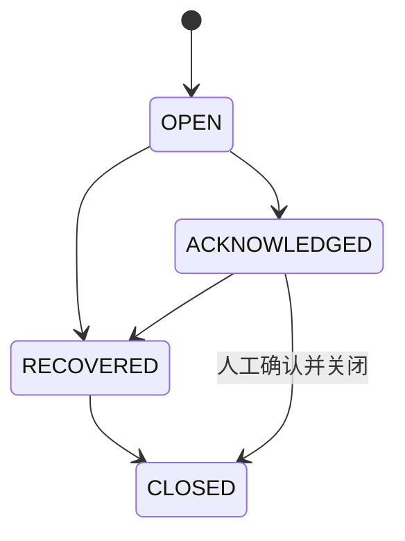

# 领域模型

## 1. 统一语言

| 术语 | 定义 |
| --- | --- |
| 租户（Tenant） | 数据与权限隔离边界，一个 VPP 运营组织 |
| 组合（Portfolio） | 参与统一监控、预测和调度的一组站点 |
| 站点（Site） | 具有本地时区、电网连接点和计量边界的物理位置 |
| 设备（Device） | 光伏逆变器、储能、充电桩、电表等可观测或可控资源 |
| 遥测（Telemetry） | 设备在某一设备时间产生的测量点集合 |
| 当前状态（Device State） | 按事件时间与质量规则计算出的设备最新可信状态 |
| 预测（Forecast） | 针对目标对象、时段、指标和模型版本的一组预测点 |
| 调度计划（Schedule） | 在约束下生成的分时目标，版本化且需校验/审批 |
| 设备指令（Command） | 从已批准计划拆分出的单设备控制请求 |
| 需求响应（DR Event） | 在指定窗口要求组合削峰或填谷的业务事件 |
| 告警实例（Alarm） | 某规则对某对象的一次持续异常生命周期 |
| 审计事件（Audit Event） | 对主体、动作、对象、原因、输入和结果的追加式记录 |

## 2. 边界上下文

### 2.1 资源管理

拥有 Tenant、Portfolio、Site、DeviceModel、Device、TariffPlan 和设备能力。负责身份、归属、配置版本与参与调度资格，不拥有高频遥测。

### 2.2 设备接入

拥有 DeviceSession、协议适配、上报校验、标准事件和下行连接。它只做轻量协议/身份校验，不在 Netty EventLoop 中执行数据库查询、优化或模型调用。

### 2.3 实时状态与告警

从标准事件计算 DeviceState、SiteSnapshot、PortfolioSnapshot 和 Alarm。当前状态是可重建投影，不是原始事实的唯一来源。

### 2.4 预测

拥有 DatasetSnapshot、ModelVersion、ForecastRun 和 ForecastSeries。预测输出必须引用输入数据截止点和模型版本。

### 2.5 调度与指令

调度上下文拥有 Schedule 聚合；指令上下文拥有 Command 聚合。计划表达“希望发生什么”，指令/回执表达“设备实际做了什么”，两者不可混用。

### 2.6 需求响应与效果评估

DR Event 表达外部或内部响应目标；Evaluation 使用基线、计划和实测事实计算结果，不修改原计划。

### 2.7 审计

消费领域变更和用户操作，形成追加式记录。审计服务不可反向成为业务事务的单点阻塞；关键写操作在业务事务中使用 Outbox，异步固化审计事件。

## 3. 聚合与不变量

### 3.1 Device 聚合

**实体/值对象：** Device、DeviceCapability、TelemetryPointDefinition、SafetyEnvelope、CredentialReference。

**不变量：**

- `device_id` 在租户内唯一，归属一个站点。
- 启用设备必须绑定型号和可验证凭证。
- 可控点必须声明单位、最小值、最大值和安全回退值。
- 维护、停用或被安全锁定的设备不可进入新自动调度。
- 修改安全边界产生新配置版本，不能覆盖历史计划所引用的版本。

### 3.2 ForecastRun 聚合

**实体/值对象：** ForecastRun、ForecastSeries、ForecastPoint、DatasetSnapshot、ModelReference、QualityReport。

**不变量：**

- 一个序列固定目标、指标、时间粒度和单位。
- `SUCCEEDED` 的次日预测必须覆盖本地次日转换后的全部调度时段；普通日期为 96 点，夏令时日期允许按时区规则变化。
- 不充分数据只能产生 `INSUFFICIENT_DATA`，不能伪装为成功。
- 人工修正生成新的 ForecastVersion，并引用被修正版本、操作者和原因。

### 3.3 Schedule 聚合

**实体/值对象：** Schedule、ScheduleVersion、ScheduleTarget、ConstraintSnapshot、OptimizationSummary、Approval。

**不变量：**

- 每个版本引用不可变的预测、电价、设备配置和算法版本。
- 只有 `VALIDATED` 计划可审批；只有 `APPROVED` 计划可激活。
- 同一组合和时间范围最多一个 ACTIVE 计划，替代必须显式取消旧版本。
- 硬约束不满足时只能返回不可行结果，不能生成可审批计划。
- 人工变更生成新版本并重新校验，不修改已审批版本。

状态机：

### 3.4 Command 聚合

**实体/值对象：** Command、CommandAttempt、CommandAck、ExecutionResult。

**不变量：**

- `command_id` 全局唯一；同一计划、设备、时段和动作具有稳定幂等键。
- 终态不可回退；迟到回执保留但不能把 SUCCEEDED 改为 EXECUTING。
- 重试创建 CommandAttempt，不创建语义重复的 Command。
- 只有明确支持的设备能力可以生成对应动作。

### 3.5 Alarm 聚合

告警去重键为 `tenant_id + object_id + rule_id + correlation_window`。RECOVERED 表示条件消失，ACKNOWLEDGED 表示人员知晓，两者是正交事实；为简化 UI，聚合状态按业务转换保存，时间线保留全部事件。

### 3.6 DemandResponseEvent 聚合

**状态：** DRAFT → ASSESSED → APPROVED → ACTIVE → COMPLETED/FAILED/CANCELLED。

**不变量：** 评估结果必须区分承诺容量与可用容量；目标超过可用容量时，只有显式接受缺口后才能审批，且报告不得将缺口隐藏为设备失败。

## 4. 设备类型与标准测点

| 类型 | 必需测点 | 可选测点 | 可控动作 |
| --- | --- | --- | --- |
| METER | `active_power_kw`, `energy_import_kwh` | voltage, current, frequency | 无 |
| PV_INVERTER | `active_power_kw`, `energy_generated_kwh`, `status` | irradiance, temperature | `SET_ACTIVE_POWER_LIMIT` |
| BATTERY | `active_power_kw`, `soc_pct`, `available_capacity_kwh`, `status` | soh, cell_temperature | `SET_POWER`, `STOP` |
| EV_CHARGER | `active_power_kw`, `connector_status`, `session_energy_kwh` | vehicle_soc, departure_time | `SET_CHARGE_LIMIT`, `PAUSE`, `RESUME` |

设备原始字段先映射到标准点名。未知字段可保留在 `extensions`，但不能在未注册的情况下参与规则或优化。

## 5. 单位、精度与时间

- 功率：kW，内部十进制定点语义，API 使用 JSON number，财务计算不得直接使用二进制浮点累计。
- 电量：kWh；累计电量回退需标记设备重置或异常，不能直接产生负用量。
- SOC：0–100%，有效业务范围由设备安全边界进一步限制。
- 价格：`CNY/kWh`，控制面使用高精度 decimal。
- 时间：事件使用 RFC 3339 UTC；调度点通过 `interval_start` 唯一定位，站点时区仅用于生成与展示日历日。

## 6. 领域事件

关键事件包括：

- `DeviceRegistered`, `DeviceAvailabilityChanged`, `TelemetryAccepted`, `TelemetryRejected`
- `DeviceStateUpdated`, `AlarmOpened`, `AlarmAcknowledged`, `AlarmRecovered`
- `ForecastRunCompleted`, `ForecastRunInsufficientData`, `ForecastOverridden`
- `ScheduleGenerated`, `ScheduleValidated`, `ScheduleApproved`, `ScheduleActivated`, `ScheduleStopped`
- `CommandCreated`, `CommandDispatched`, `CommandAcknowledged`, `CommandTerminal`
- `DemandResponseAssessed`, `DemandResponseActivated`, `DemandResponseCompleted`
- `EvaluationCompleted`, `AuditEventAppended`

事件名表达已发生事实。命令使用祈使语义并走独立命令主题，不能混在事实事件中。

