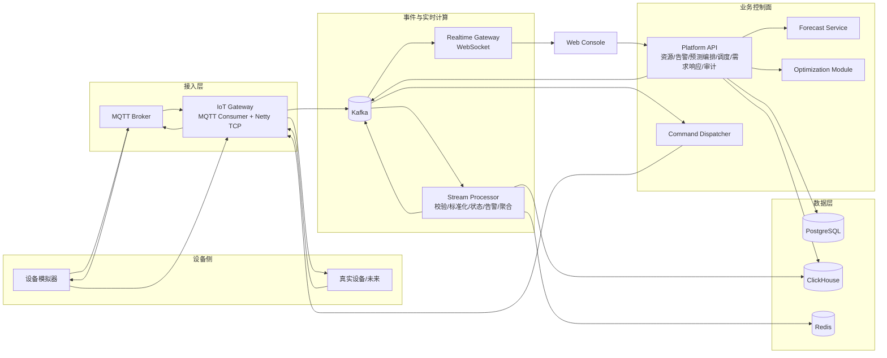

# 系统架构

## 1. 架构原则

1. 高频数据面与低频控制面分离。
2. 设备协议在接入层收敛，后续服务只处理版本化标准事件。
3. Kafka 提供至少一次事件流；业务以幂等、状态机和可重放投影实现一致性。
4. PostgreSQL 保存配置、工作流和审计等事务事实；ClickHouse 保存高频曲线和分析事实；Redis 只保存可重建短期状态。
5. 计划生成与设备执行分离，任何算法输出都不能绕过校验、审批和安全边界。
6. MVP 控制服务采用模块化单体降低运维成本，接入、流处理、预测保持独立进程以体现伸缩边界。

## 2. 逻辑架构



## 3. 推荐代码库布局

首版使用独立 monorepo；不要把业务项目添加为 Netty 上游根 `pom.xml` 的模块。

```text
vpp-platform/
├── apps/
│   ├── iot-gateway/          # Java：MQTT/Netty 接入、会话、下行路由
│   ├── stream-processor/     # Java：Kafka Streams/Spring Kafka 实时处理
│   ├── platform-api/         # Java：模块化单体控制面与 REST API
│   ├── device-simulator/     # Java：光伏/储能/充电桩/电表模拟
│   └── web-console/          # Next.js：运营控制台
├── services/
│   └── forecast-service/     # Python：训练、推理、评估 API
├── contracts/
│   ├── asyncapi/             # MQTT/Kafka/WebSocket 契约
│   └── openapi/              # REST 契约
├── db/
│   ├── postgres/
│   └── clickhouse/
├── infra/
│   ├── compose/
│   └── observability/
└── docs/
```

当前阶段只创建规格文档；上述目录在实现任务 T00 中初始化。

## 4. 组件职责

### 4.1 IoT Gateway（Java/Netty）

- MQTT 适配器订阅设备上行主题；Netty TCP 适配器处理长连接和自定义帧。
- 在 I/O 线程只完成解帧、基本长度限制和异步交接；认证、注册查询和 Kafka 发送不得阻塞 EventLoop。
- 根据设备会话维护下行路由；MQTT 指令发布到设备专属主题，TCP 指令写入活动 Channel。
- 对 payload 大小、连接速率、认证失败和空闲连接设置限制。
- 接入失败分为协议错误、身份错误、契约错误、下游不可用，便于告警和重试。

### 4.2 Stream Processor（Java）

- 标准化原始事件、单位转换、schema 校验和数据质量打标。
- 以 `event_id` 去重，以事件时间和水位线处理乱序；超出窗口的事件进入历史但不回退当前状态。
- 生成设备/站点/组合快照，计算离线与规则告警。
- 将遥测批量写入 ClickHouse，当前状态写入 Redis，并发布派生事件。
- Redis/ClickHouse 写入失败时不提交相应 Kafka offset，确保可重放；毒消息进入 DLQ。

### 4.3 Platform API（Java 模块化单体）

内部模块：`identity`、`resource`、`tariff`、`alarm`、`forecast`、`schedule`、`demand-response`、`command`、`audit`、`reporting`。

- Controller 只处理协议、认证、校验和 DTO 映射；业务不变量位于领域/应用服务。
- 计划审批、取消、人工覆盖等写操作使用 PostgreSQL 事务。
- 需要发 Kafka 事件的事务使用 Transactional Outbox，避免“数据库已提交但事件丢失”。
- 查询实时快照优先 Redis，历史曲线查询 ClickHouse，工作流查询 PostgreSQL。

### 4.4 Forecast Service（Python）

- 训练和推理解耦；训练作业产生不可变模型工件与指标，推理按 `model_version` 执行。
- MVP 至少实现持久性/同类日基线和 LightGBM/XGBoost 候选模型，以滚动时间窗验证选择。
- 输入包含负荷/光伏历史、日历、模拟/导入天气；缺失与插值比例形成质量报告。
- API 返回作业 ID，长任务异步执行；平台通过状态查询或完成事件获取结果。
- 模型不可用时允许使用已批准的基线模型，不允许编造天气或预测点。

### 4.5 Optimization Module（Java 控制面内）

- 输入：预测版本、电价版本、设备配置快照、初始 SOC、可用性和 DR 目标。
- 决策变量：每设备每时段充电功率、放电功率、可选的充电桩限功率。
- 目标：最小化购电成本 + 储能衰减成本 + 需求/DR 违约惩罚。
- 硬约束：SOC、充放电功率、容量、效率、禁止同时充放电、设备可用性。
- 结果分为 FEASIBLE、INFEASIBLE、FAILED；只有 FEASIBLE 可形成待审批计划。
- OR-Tools 不可用时可以生成规则基线，但必须标记 `algorithm=RULE_BASELINE`，不可伪装为优化结果。

### 4.6 Command Dispatcher

- 读取已创建指令，按设备/连接限速后交给 IoT Gateway。
- 将每次尝试写入状态事件，按可重试错误、截止时间和退避策略决定重发。
- 指令超时使用持久化截止时间/延迟调度实现，不依赖单进程内存定时器。
- 服务重启后从 Command 当前状态恢复未完成工作。

## 5. 数据流

### 5.1 遥测上行

1. 设备向 MQTT 主题或 TCP 连接发送带 `event_id`、序列号和设备时间的 payload。
2. Gateway 鉴权、限流、封装接收元数据，写 `vpp.telemetry.raw.v1`。
3. Stream Processor 校验设备点表、标准化单位和质量，写 `vpp.telemetry.normalized.v1`；无效事件写 DLQ。
4. ClickHouse sink 批量持久化，状态处理器更新 Redis 并发布快照/告警。
5. Realtime Gateway 将聚合事件推送至已授权 WebSocket 订阅；UI 以 REST 快照作为首次加载和重连兜底。

### 5.2 日前预测与调度

1. 调度作业冻结输入数据截止点并创建 ForecastRun。
2. Forecast Service 读取经质量过滤的数据，生成次日预测和指标。
3. Platform API 冻结预测、电价、配置与可用性版本，调用优化模块。
4. 可行解保存为 DRAFT，经约束验证后进入 VALIDATED。
5. 运营员比较基线、成本、峰值、循环与告警，审批后生成 Outbox 事件。
6. Dispatcher 在执行窗口创建/发送设备指令，回执驱动状态机。
7. 时段结束后 Evaluation 使用实测曲线计算偏差和收益，不使用目标值代替实测。

## 6. API 与 UI 契约概要

### 6.1 REST 资源

- `/api/v1/portfolios`, `/sites`, `/devices`, `/device-models`
- `/api/v1/telemetry/query`, `/snapshots`
- `/api/v1/alarms/{id}/acknowledge|close`
- `/api/v1/forecast-runs`, `/forecasts/{id}`, `/forecasts/{id}/overrides`
- `/api/v1/schedules`, `/schedules/{id}/validate|approve|cancel|emergency-stop`
- `/api/v1/commands`, `/demand-response-events`, `/audit-events`, `/reports`

所有写请求支持 `Idempotency-Key`，错误响应包含稳定 `code`、安全 `message`、`trace_id` 和可选字段错误。

### 6.2 运营控制台信息架构

| 页面 | 决策 | 核心证据 | 主要动作 |
| --- | --- | --- | --- |
| 实时总览 | 当前组合是否健康 | 数据新鲜度、功率平衡、在线率、活动告警 | 下钻站点/设备 |
| 告警中心 | 哪些异常先处理 | 严重度、持续时长、影响容量、时间线 | 确认、备注、关闭 |
| 预测中心 | 明日预测是否可信 | 数据完整率、模型版本、误差、预测/实际 | 生成、覆盖、对比 |
| 调度中心 | 计划是否安全且值得执行 | 约束、成本差、峰值差、循环次数 | 生成、审批、取消 |
| 执行监控 | 计划是否实际完成 | 指令状态、计划/实际偏差、失败原因 | 重试许可、紧急停止 |
| 需求响应 | 能否承诺并达成目标 | 可用容量、缺口、基线质量、达成率 | 评估、审批、结束 |
| 审计 | 决策链是否可解释 | 输入版本、操作者、状态转换、关联 ID | 筛选、导出 |

每个实时组件必须显示最后更新时间；`stale`、`partial`、`unknown`、`unverified` 不得用正常绿色状态呈现。

## 7. 一致性与失败处理

- **Kafka 顺序：** 遥测按 `tenant_id:device_id` 分区；计划/指令按 `device_id` 分区，保证单设备有序，不保证跨设备全序。
- **幂等：** 消费者持久化 `event_id`/业务幂等键；ClickHouse 原始事实允许重复到达，但查询与投影按业务键选定最终版本。
- **Outbox：** 控制面事务和 outbox 同库提交，relay 重试发布；消费者仍必须幂等。
- **重放：** 重建投影使用独立 consumer group 和目标表/命名空间，验证后再切换，避免污染在线状态。
- **背压：** Gateway Kafka 发送队列达到上限后暂停读取/拒绝新数据并暴露指标，不能无限占用堆内存。
- **降级：** ClickHouse 查询故障不影响设备指令回执；预测/优化故障阻止新计划，但不篡改已审批计划。

## 8. 安全边界

- MQTT 使用 TLS 与每设备凭证/证书，ACL 限制发布和订阅主题；TCP 使用 TLS + 设备身份握手。
- 平台用户使用 OIDC/OAuth2，后端执行租户与对象范围授权，不能只依赖前端隐藏按钮。
- 设备密钥、数据库密码、JWT 签名密钥通过环境 secret 或 secret manager 注入，不进入仓库、日志或事件 payload。
- 命令 payload 使用版本、过期时间、nonce/幂等键；未来连接真实设备时增加签名与防重放。
- 审计记录做访问控制、保留策略和可选哈希链；MVP 不宣称达到监管级不可篡改认证。

## 9. 可观测性与 SLO

关键指标：连接数、认证失败率、遥测接收/拒绝率、Kafka lag、处理延迟、ClickHouse 批写失败、WebSocket 订阅数、预测/优化耗时、不可行率、指令各状态延迟、告警风暴率、Outbox 积压。

健康端点分层：

- liveness：进程和事件循环仍工作，不检查所有下游。
- readiness：当前实例是否可接流量，检查必需依赖和队列水位。
- business health：数据新鲜度、设备在线率、消费延迟，通过运营指标而非容器重启处理。

全链路使用 OpenTelemetry；日志结构化并脱敏，至少带 tenant、service、trace 和相关业务 ID。

## 10. 运行拓扑与配置

本地 Compose 至少包含：PostgreSQL、ClickHouse、Kafka（KRaft）、MQTT Broker、Redis、OpenTelemetry Collector、Prometheus、Grafana，以及各应用进程。

环境变量按服务前缀命名并维护 `.env.example`；浏览器只使用公开 API/WS URL，容器间连接使用 Compose 服务名。任何生产模式缺失必需 secret 时应 fail-fast。

## 11. 架构决策记录（待建立）

- ADR-001：MVP 模块化单体与独立数据面进程。
- ADR-002：MQTT Broker 选择与 ACL 模型。
- ADR-003：Kafka Streams、普通 Spring Kafka 或 Flink 的选择；MVP 默认 Kafka Streams/Spring Kafka。
- ADR-004：优化求解器与许可证/部署边界。
- ADR-005：审计不可变性和保留等级。
- ADR-006：多租户隔离从逻辑隔离升级的触发条件。

## 12. 主要风险

| 级别 | 风险 | 控制措施 |
| --- | --- | --- |
| P0 | 错误计划损害设备或违反安全边界 | 硬约束、二次校验、审批、紧急停止、设备本地保护 |
| P0 | 重复/迟到消息导致重复控制或状态回退 | 稳定幂等键、终态不回退、事件时间、水位线、重放测试 |
| P0 | 租户越权或设备冒用 | 服务端对象授权、设备独立凭证、MQTT ACL、安全测试 |
| P1 | Kafka/ClickHouse 积压造成“假实时” | 新鲜度显示、lag 告警、背压、容量测试 |
| P1 | 模型数据不足或漂移 | 质量门槛、基线模型、版本指标、拒绝伪造结果 |
| P1 | 指令已下发但回执丢失 | 明确 UNKNOWN/TIMED_OUT、状态查询/幂等重试、不假定成功 |
| P2 | 架构拆分过早增加运维负担 | 控制面模块化单体，按伸缩/故障边界拆分 |
| P2 | 演示天气/电价被误认为真实 | 来源与版本标签，模拟数据显著标识 |
