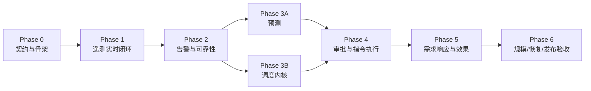

# 交付计划与任务清单

## 1. 交付策略

采用纵向切片：每个阶段都形成可演示、可验证的业务增量。只有共享契约稳定后才并行开发，集成和最终验收由架构负责人统一负责。

进度标签：`planned → implemented → unit_verified → contract_verified → runtime_verified → product_verified`。构建成功不等于产品闭环完成。

## 2. 角色分工

| 角色 | 必需性 | 责任 |
| --- | --- | --- |
| 架构负责人 / orchestrator-lead | 必需 | 契约、边界、集成、风险和最终验收 |
| 产品经理 | 必需（Phase 0/验收） | PRD、状态、指标、范围变更 |
| Java 后端 | 必需 | Gateway、流处理、控制面、优化与模拟器 |
| 前端 UI | 必需 | 运营控制台和实时/异常/不足数据状态 |
| AI/数据工程 | 必需（Phase 3） | 数据集、基线、模型、评估与服务化 |
| QA | 必需 | 契约、集成、性能、故障恢复与 E2E |
| DevOps | 必需 | Compose、CI、配置、可观测性、恢复 |
| 安全评审 | 真实设备前必需 | 设备身份、ACL、命令防重放、租户隔离 |

## 3. 串并行顺序

- Phase 0 必须串行完成共享契约与仓库骨架。
- Phase 1 中设备模拟器、Gateway 和 UI 骨架可并行，但必须使用同一 fixture/schema。
- Phase 3 的预测与调度内核可并行；调度先使用固定预测 fixture，随后做真实契约集成。
- 每阶段末由 QA + 架构负责人跑纵向验收，不把未集成分支标为完成。

## 4. 阶段里程碑

| 阶段 | 业务结果 | 退出门禁 |
| --- | --- | --- |
| 0 契约与骨架 | 全栈可构建、依赖可启动、契约可验证 | Compose 健康；CI 基线通过；无真实 secret |
| 1 遥测闭环 | 模拟设备数据在 3 秒内显示于 UI | MQTT+TCP fixture 同义；曲线可查；断流显示 stale |
| 2 可靠性与告警 | 异常可发现、确认、恢复并追踪 | 重复/乱序/积压/重启测试通过 |
| 3 预测与优化 | 产生可信 96 点预测和可行候选计划 | 数据不足真实呈现；硬约束属性测试通过 |
| 4 执行闭环 | 审批后下发指令并跟踪终态 | 幂等重试、超时、紧急停止和审计 E2E 通过 |
| 5 需求响应 | 评估容量、分解目标、计算达成率 | 不足容量显式；基线与质量可追溯 |
| 6 发布验收 | 1,000 设备稳定演示且可恢复 | 2 小时压测、组件重启、备份恢复演练通过 |

## 5. 实现任务

### T00：独立仓库骨架与开发环境

- **状态：** `runtime_verified`（2026-08-12）
- **负责人：** 架构负责人 + DevOps
- **目标：** 建立不侵入 Netty 上游构建的 VPP monorepo 和可复现本地环境。
- **范围/文件：** `apps/*`、`services/forecast-service`、`contracts/*`、`infra/compose`、根构建文件、`.env.example`、CI。
- **输入：** 架构文档第 3/10 节、数据存储职责。
- **输出：** Java/Python/Next.js 空骨架，PostgreSQL、ClickHouse、Kafka、MQTT、Redis 与可观测性依赖。
- **验收：** 一条命令启动依赖；各服务 liveness/readiness 可区分；缺失生产 secret 时失败；不修改 Netty 根 `pom.xml`。
- **验证：** `docker compose config`；`docker compose up -d --wait`；Java/Python/Web 构建与空测试。
- **依赖：** 无。
- **禁止触碰：** `vpp-platform/` 外现有源码和用户未提交改动；不得提交 `.env` 或真实凭证。

### T01：契约可执行化

- **状态：** `contract_verified`（2026-08-12）
- **负责人：** 架构负责人 + Java 后端
- **目标：** 将本文档中的 REST、MQTT、Kafka、WebSocket 契约固化为 OpenAPI、AsyncAPI 和 JSON Schema/Avro/Protobuf（选择一种 Kafka schema 技术并记录 ADR）。
- **范围/文件：** `contracts/openapi/*`、`contracts/asyncapi/*`、`contracts/schemas/*`、共享 fixture。
- **输入：** `04-event-contracts.md`。
- **输出：** 可 lint、可生成类型、带兼容测试的版本化 schema。
- **验收：** 遥测/命令/回执/告警/计划事件齐全；破坏性变更被 CI 拦截；secret 字段不进入日志 schema。
- **验证：** 契约 lint；schema compatibility tests；共享 fixture round-trip tests。
- **依赖：** T00。
- **禁止触碰：** 不引入未验证的 Broker/Schema Registry 能力，不把生成代码手工改成事实源。

### T02：设备模拟器

- **状态：** `runtime_verified`（MQTT + TCP，2026-08-12）
- **负责人：** Java 后端
- **目标：** 模拟电表、光伏、储能和充电桩的可重复时序行为、网络异常和指令执行。
- **范围/文件：** `apps/device-simulator`。
- **输入：** 标准测点、MQTT/TCP 契约、场景种子。
- **输出：** MQTT/TCP 客户端、晴/阴/工作日场景、断线/漂移/重复/越界注入、回执状态机。
- **验收：** 相同 seed 得到可重放曲线；设备遵守 SOC/功率边界；重复命令不重复执行；所有模拟数据标 `SIMULATED`。
- **验证：** 单元测试；100 设备 30 分钟 smoke；命令幂等集成测试。
- **验证证据：** 100 设备 × 360 tick（30 分钟仿真时钟）确定性重放通过；100 个真实 MQTT 客户端完成 1,000 条遥测和 500 条心跳、失败数 0；MQTT `SET_POWER` 首次三阶段回执与重复幂等键单终态回执通过；VPP1 TCP codec、TLS/认证边界由自动测试覆盖。
- **依赖：** T01。
- **禁止触碰：** 不连接真实设备，不把随机噪声当真实预测精度证据。

### T03：MQTT/Netty 设备接入网关

- **状态：** `runtime_verified`（本地 Compose，2026-08-12）
- **负责人：** Java 后端
- **目标：** 安全、非阻塞地接入两种协议并统一写入 Kafka，同时路由下行命令。
- **范围/文件：** `apps/iot-gateway`。
- **输入：** 设备身份/ACL、TCP 帧、raw telemetry/command schema。
- **输出：** 认证、限流、帧解码、会话、心跳、Kafka producer、MQTT/TCP 下行适配器。
- **验收：** EventLoop 无阻塞 DB/HTTP 调用；坏帧/超长帧/未认证消息被拒；Kafka 不可用时背压有界；日志脱敏。
- **验证：** Netty EmbeddedChannel tests；Testcontainers Kafka/MQTT 集成；协议 fuzz/边界测试；连接重启测试。
- **验证证据：** 19 项自动测试覆盖主题解析、严格 JSON/点表校验、固定工作池与 Kafka in-flight 背压、VPP1 拆包/粘包解码、超长帧预拒绝与坏头变体、认证前拒绝、错误凭证、严格序列和断线重认证；本地 Compose 实测 4 个 MQTT 会话和 4 个 TCP 认证会话均将原始遥测写入 Kafka 且带协议/接收时间头；BESS `SET_POWER` 经 TCP 下发并收到 `ACCEPTED`、`EXECUTING`、`SUCCEEDED` 三阶段回执；设备退出后 TCP 会话归零。容器化集成目前为本地 Compose 证据，尚未固化为 CI Testcontainers 套件。
- **依赖：** T01，可与 T02 并行。
- **禁止触碰：** 不修改 Netty 框架源码来适配业务；不在内存无限缓存遥测。

### T04：资源管理与设备身份

- **状态：** `runtime_verified`（本地 Compose，2026-08-12）
- **负责人：** Java 后端
- **目标：** 提供租户、组合、站点、型号、设备、电价和能力配置的控制面事实源。
- **范围/文件：** `apps/platform-api` 的 identity/resource/tariff 模块，`db/postgres`。
- **输入：** PRD 权限规则、PostgreSQL 模型。
- **输出：** 迁移、领域服务、REST API、RBAC/对象授权、凭证引用与审计 Outbox。
- **验收：** 跨租户对象访问被拒；停用设备不可接入/调度；配置版本可追溯；电价区间校验无重叠。
- **验证：** 单元 + PostgreSQL Testcontainers + 授权集成测试；OpenAPI contract tests。
- **验证证据：** Platform API 6 项测试和 IoT Gateway 21 项测试通过；PostgreSQL Testcontainers 覆盖 Flyway、资源创建、跨租户 404、凭据不回显、停用、审计不可变、Outbox、幂等和电价区间排斥约束。Compose 实测 3 台控制面注册设备建立 TCP 会话并写入 Kafka；停用 BESS 后身份与活跃会话均从 3 降为 2，后续遥测和重连被拒。数据库确认 3 份凭据无明文，审计与 Outbox 各 15 条。
- **依赖：** T00、T01。
- **禁止触碰：** DTO 不直接作为持久实体；凭证明文不回显/落库/落日志。

### T05：实时标准化、存储与状态聚合

- **状态：** `runtime_verified`（本地 Compose，2026-08-12）
- **负责人：** Java 后端/实时计算
- **目标：** 将 raw 遥测变成可查询曲线和可重建当前状态。
- **范围/文件：** `apps/stream-processor`、`db/clickhouse`、Redis 投影。
- **输入：** normalized telemetry schema、点表和质量规则。
- **输出：** 标准化、单位转换、去重、事件时间/水位线、DLQ、CH 批写、设备/站点/组合快照。
- **验收：** 重复不重复计效；乱序不回退当前状态；无效数据不污染曲线；消费重启后结果一致。
- **验证：** Kafka+CH+Redis 集成；golden fixtures；乱序/重放属性测试；消费者重启 smoke。
- **验证证据：** Stream Processor 7 项自动测试通过，其中真实 ClickHouse/Redis Testcontainers 覆盖物理重复与业务视图去重、Lua 原子投影、重复/乱序保护和站点/组合有功功率增量；Platform API 设备目录接口由 6 项 PostgreSQL 集成测试共同覆盖。Compose 纵向实测 2 台活跃设备经 TCP/Kafka 产生 20 条 normalized telemetry；受控重复事件在 ClickHouse 仅写入一次，乱序事件保留历史但 Redis 最新状态保持 `event_id=11111111-1111-4111-8111-111111111111`/`active_power_kw=50`，未知指标 `magic_voltage` 以 `UNKNOWN_METRIC` 进入 DLQ 且 ClickHouse 无对应事件。契约测试通过 11 个 schema、10 个有效 fixture、3 个反例及兼容性锁。
- **依赖：** T03、T04。
- **禁止触碰：** 不宣称 exactly-once；不能依赖 ClickHouse 异步 merge 立即去重。

### T06：实时控制台与 WebSocket

- **状态：** `runtime_verified`（本地 Compose + Chrome，2026-08-12）
- **负责人：** 前端 UI + Java/TS 实时网关
- **目标：** 让运营员从组合下钻到设备并正确识别实时、过期、部分和错误状态。
- **范围/文件：** `apps/web-console`、Realtime Gateway 或 Platform API WS 模块。
- **输入：** UI 契约、REST/WS schema、快照 API。
- **输出：** 总览、站点/设备详情、曲线、连接状态、cursor 恢复与 REST resync。
- **验收：** 所有指标有单位和更新时间；断流显示 stale；慢消费者受控；用户只能订阅授权 channel；桌面与告警移动查看无溢出。
- **验证：** typecheck/build；组件状态测试；Playwright 断线重连 E2E；浏览器视口和可访问性检查。
- **验证证据：** Web 控制台状态测试、TypeScript 和 Next.js 生产构建通过；Platform API 6 项 PostgreSQL/Testcontainers 回归、12 个 schema/11 个有效 fixture/3 个反例的契约门禁通过。Compose 真实链路读取 PostgreSQL 授权资源、Redis 快照和 ClickHouse 曲线；WebSocket 使用单次 30 秒 ticket，从 cursor `0000000000000001` 补发 9 个事件至 `0000000000000010`，越权组合只返回 `FORBIDDEN_CHANNEL` 且不误发 `subscribed`。Chrome 桌面及 iPhone 14 Pro Max 430×932 设备视口验证完成，移动页面宽度等于视口宽度，设备表在局部容器内滚动；UI 正确展示 stale、缺测、质量和更新时间，没有伪造在线状态或曲线。
- **依赖：** T01；可用 fixture 与 T03/T05 并行，最终依赖真实链路集成。
- **禁止触碰：** 不展示假曲线/假在线状态；不在浏览器暴露内部 Kafka/MQTT 地址或 secret。

### T07：告警中心

- **状态：** `runtime_verified`（本地 Compose + 浏览器，2026-08-12）
- **负责人：** Java 后端 + 前端 UI
- **目标：** 实现离线、越界、突变、过期、指令超时的去重生命周期和处置界面。
- **范围/文件：** stream alarm processor、Platform API alarm 模块、Web 告警页。
- **输入：** Alarm 状态机、规则配置、状态事件。
- **输出：** 规则、告警/转换持久化、实时推送、确认/备注/关闭 UI。
- **验收：** 告警风暴被去重；恢复和确认不混淆；规则异常时展示覆盖不足；所有人工动作审计。
- **验证：** 状态机属性测试；重复/恢复/并发确认集成；告警 E2E。
- **验证证据：** Platform API 9 项 PostgreSQL/Testcontainers 测试覆盖首次打开、相同事件去重、新事件计数、恢复、关闭门禁、跨租户 404、审计与时间线不可变；Web 3 项状态/契约测试、TypeScript、Next.js 生产构建及 12 个 schema/11 个有效 fixture/3 个反例契约门禁通过。Compose 实测 V2 迁移、离线/过期规则评估、`OPEN → ACKNOWLEDGED → RECOVERED → CLOSED` 及恢复后复发重开；Outbox 4/4 发布并从 `vpp.alarm.events.v1` 消费到真实事件。浏览器确认告警后 UI 状态/时间线同步更新，无错误覆盖层或控制台错误；390×844 视口无横向溢出。`SUDDEN_CHANGE` 与 `COMMAND_TIMEOUT` 如实标为未支持。
- **依赖：** T05、T06。
- **禁止触碰：** 不因 UI 关闭而删除告警事实，不让通知失败阻塞告警创建。

### T08：日前预测服务

- **负责人：** AI/数据工程
- **目标：** 生成版本化的次日负荷/光伏预测和可信质量/误差报告。
- **范围/文件：** `services/forecast-service`、Platform API forecast 编排、预测 UI。
- **输入：** CH 聚合曲线、日历、模拟/导入天气、充分性规则。
- **输出：** 持久性/同类日基线、LightGBM/XGBoost 模型、训练/推理作业、模型工件、96 点序列和指标。
- **验收：** 时间序列滚动验证无未来泄漏；数据不足返回明确状态；模型/数据截止/特征版本可追溯；人工覆盖保留原值。
- **验证：** Python unit/integration；固定数据集 golden test；泄漏检测；API contract；预测页面状态 E2E。
- **验证证据：** Python 6 项测试覆盖 96/100 点、数据充分性、完整率和未来泄漏；Platform API PostgreSQL/Testcontainers 集成覆盖异步成功/不足、幂等、租户隔离、只追加版本与人工覆盖；OpenAPI/AsyncAPI/fixture 门禁和 Next.js 类型检查、生产构建通过。预测运行与 UI 已实现，浏览器实链路验证待本地完整历史数据集准备后执行。
- **依赖：** T05、T06。
- **禁止触碰：** 不用随机划分冒充时序验证；不将插值/模拟天气表示为实测；不声称未验证的精度。

### T09：优化调度内核

**状态：已完成（2026-08-13）**

- **负责人：** Java 后端 + 能源算法
- **目标：** 从版本化输入生成满足硬约束的候选计划，并提供规则基线对照。
- **范围/文件：** Platform API schedule/optimization 模块。
- **输入：** 预测/电价/设备配置 fixture，SOC 与可用性。
- **输出：** 优化模型、不可行诊断、计划版本、成本/峰值/循环摘要。
- **验收：** 所有硬约束逐点成立；输入相同则结果可复现（允许求解器容差）；不可行不产生可审批计划；规则基线标签真实。
- **验证：** 小规模手算 golden cases；随机约束属性测试；求解超时/不可用降级；计划版本持久化集成。
- **依赖：** T04、T01；可与 T08 并行，最终接入其真实输出。
- **禁止触碰：** 不将目标功率当实际效果，不静默放松硬约束。
- **实现说明：** 当前 `RULE_BASELINE 1.0.0` 同步生成 15 分钟候选，低价充电、高价放电，同时优先处理并网硬约束；入库前独立复核 SOC 递推、功率边界、充放电互斥、并网限值和目标点完整性。设备容量、功率、SOC 范围、效率和初始 SOC 被捕获为不可变配置快照，版本固定引用负荷预测、光伏预测和电价计划。聚合预测尚不能证明多站点各自并网约束，因此多站点明确返回不可行，不做隐式功率分摊。
- **验证证据：** Java golden/不可行/100 组随机属性测试通过；PostgreSQL 17.6 Testcontainers 从空库成功应用 V1-V5，并覆盖 HTTP 幂等、96 点版本持久化、不可行不生成版本、租户内查询、只追加触发器、审计与 Outbox；OpenAPI/AsyncAPI/fixture 门禁及 Next.js 16 类型检查、生产构建通过。

### T10：审批、指令与完整审计

- **负责人：** Java 后端 + 前端 UI
- **目标：** 形成“计划比较 → 校验 → 审批 → 下发 → 回执 → 超时/停止 → 审计”闭环。
- **范围/文件：** schedule/command/audit 模块、Dispatcher、Gateway 下行、调度与执行页面。
- **输入：** T03/T09、Command schema、状态机。
- **输出：** Outbox、审批权限、持久化定时调度、幂等尝试、执行监控、紧急停止、审计查询。
- **验收：** 未审批不下发；重复 relay/回执不重复执行或回退终态；服务重启恢复未完成命令；按 schedule ID 还原全链路。
- **验证：** 跨服务 Testcontainers E2E；kill/restart recovery；超时和迟到回执；权限与审计不可静默修改测试。
- **依赖：** T03、T06、T09。
- **禁止触碰：** 不使用单进程临时定时器作为唯一调度事实；不在回执未知时标记成功。

### T11：需求响应与效果评估

- **负责人：** 产品 + Java 后端 + 前端 UI + 数据工程
- **目标：** 创建响应事件、评估/分配容量、执行并以实测核算达成率。
- **范围/文件：** demand-response/reporting 模块与页面、CH 分析查询。
- **输入：** DR 规则、基线版本、调度/指令/实测数据。
- **输出：** DR 状态机、容量评估、目标分配、基线、达成率和质量等级。
- **验收：** 容量不足显式展示；基线可重算且版本化；缺测不算作成功；报告可追溯到实测 event/interval。
- **验证：** 基线 golden dataset；不足/部分执行/缺测 E2E；财务小数精度测试。
- **依赖：** T08、T10。
- **禁止触碰：** 不做真实市场结算或收益分账，不把承诺容量当实绩。

### T12：规模、故障恢复与发布门禁

- **负责人：** QA + DevOps + 架构负责人
- **目标：** 验证 MVP 指标、恢复能力、可观测性和发布边界。
- **范围/文件：** `tests/performance`、`tests/e2e`、`infra/observability`、runbook、CI。
- **输入：** 成功指标和 P0 风险。
- **输出：** 1,000 设备负载报告、故障注入结果、仪表盘/告警、备份恢复记录、演示脚本。
- **验收：** 5 秒遥测持续 2 小时；端到端 P95 ≤ 3 秒；有效进入 Kafka ≥ 99.9%；Kafka/CH/API/Gateway 重启结果有证据；无发布阻塞项。
- **验证：** `make test`、`make test-contract`、`make test-e2e`、`make test-load`、`make restore-drill`（任务实现时提供这些稳定入口）。
- **依赖：** T02–T11。
- **禁止触碰：** 不以单次本机结果宣称生产容量；测试不得指向真实设备/生产环境；不删除故障证据掩盖失败。

## 6. 最小测试矩阵

| 风险 | 单元/属性 | 契约/集成 | E2E/运行时 |
| --- | --- | --- | --- |
| 遥测重复/乱序 | 幂等和水位线属性测试 | Kafka 重放 + CH/Redis 投影 | 重启消费者后曲线/状态一致 |
| 设备协议 | 帧长度、粘包拆包、坏 JSON | MQTT/TCP 同 fixture | 断线重连、Broker/Gateway 重启 |
| 调度安全 | SOC/功率/能量平衡属性 | 计划持久化/版本/审批 | 审批到设备实际执行 |
| 指令不确定性 | 状态机终态不回退 | 重复、超时、迟到回执 | Dispatcher/Gateway kill-restart |
| 预测真实性 | 数据充分性、泄漏检测 | 固定数据集和 API | UI 显示失败/不足/覆盖版本 |
| 租户隔离 | 授权策略 | DB/API/WS 对象范围 | 两租户跨路径攻击用例 |
| 假实时 | freshness 计算 | lag/断流状态 | UI stale 与 resync |
| 审计完整性 | digest/事件生成 | Outbox 重试 | 按 schedule ID 全链路还原 |

## 7. 发布与回滚

- Schema 先兼容扩展，再升级生产者/消费者；旧消费者保留至少一个发布窗口。
- 数据迁移先影子写/重放校验，再切读；失败切回旧投影，不立即删除旧数据。
- 新优化算法使用 feature flag/算法版本启用；可回退到上一个已验证版本或明确标注的规则基线。
- 命令服务回滚前先停止创建新计划，等待/接管未完成指令；不得靠删除状态清队列。
- 真实设备接入、资金结算和外部市场连接均需要独立发布评审，不属于本计划默认授权。

## 8. 当前进度

| 项目 | 状态 |
| --- | --- |
| 产品立项、PRD、状态矩阵 | `planned`（规格完成，业务未实现） |
| 领域、架构、事件与数据契约 | `contract_verified`（Phase 0 核心契约已可执行） |
| T00 独立骨架与环境 | `runtime_verified` |
| T01 可执行契约 | `contract_verified` |
| T02 设备模拟器 | `runtime_verified`（MQTT + TCP） |
| T03 设备接入网关 | `runtime_verified`（本地 Compose） |
| T04 资源管理与设备身份 | `runtime_verified`（本地 Compose） |
| T05 实时标准化、存储与状态聚合 | `runtime_verified`（本地 Compose） |
| T06 实时控制台与 WebSocket | `runtime_verified`（本地 Compose + Chrome） |
| T07 告警中心 | `runtime_verified`（本地 Compose + 浏览器） |
| T08 日前预测服务 | `integration_verified`（算法、API、契约、UI 构建） |
| T09 优化调度内核 | `integration_verified`（算法、硬约束、API、契约、PostgreSQL、UI 构建） |
| T10–T12 实现 | `planned` |
| 产品闭环验证 | 未开始 |
