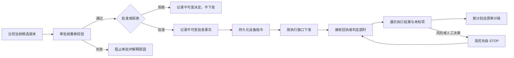

# T10 审批、指令执行与审计契约

## 1. 产品目标与完成定义

T10 面向值班运营员、计划审批人和审计员，把 T09 的可行候选计划推进为可追溯的设备控制闭环。用户从计划比较开始，确认版本、输入和安全校验结果，作出批准或拒绝决定；批准后观察每条设备指令从持久化、下发到设备回执的进展，必要时触发紧急停止，并能按 `schedule_id` 还原完整事实链。

产品闭环为：

T10 的完成点不是“计划中存在目标值”，也不是“消息已发送”，而是以下事实均可区分、查询和审计：

1. 哪个计划版本由谁在何时批准或拒绝；
2. 批准后实际创建、下发了哪些命令；
3. 设备明确回执了什么，哪些命令失败、超时或仍未知；
4. 紧急停止阻止了哪些后续动作，以及各设备是否明确确认停止；
5. 服务重启、重复投递和迟到回执没有改变历史决定或让终态回退。

## 2. 固定真实性与安全边界

- 只有同时满足 `schedule.status = VALIDATED`、`schedule.feasibility = FEASIBLE` 且 `schedule.current_version` 存在的计划可批准；批准对象必须恰好是当前版本。
- 审批决定是追加写、不可变事实。后续取消、停止或生成新版本不能覆盖、删除或伪装为未发生过批准。
- 拒绝不生成、不下发任何普通设备指令；同一版本被拒绝后不能再次批准，继续处理必须生成并重新校验新版本。
- 正常命令状态集合固定为 `CREATED`、`DISPATCHED`、`ACCEPTED`、`EXECUTING`、`SUCCEEDED`、`FAILED`、`TIMED_OUT`、`CANCELLED`；终态不可回退。
- `STOP` 是独立、高优先级命令，不通过修改普通命令的目标值来冒充停止。
- 计划目标、消息发布成功、设备在线或没有错误消息都不等于设备执行成功。只有匹配命令的明确成功回执可使命令成为 `SUCCEEDED`。
- 无回执必须呈现为等待、超时或未知，不能补零、沿用目标值或计入成功率。
- T10 不宣称端到端 exactly-once；通过稳定幂等键、追加式尝试记录和设备重复回执来避免语义重复执行。

## 3. 用户、任务与权限

### 3.1 角色与待办任务

| 角色 | 核心任务 | 允许的动作 | 明确禁止 |
| --- | --- | --- | --- |
| 计划查看者/值班运营员 | 比较计划、观察执行、定位异常 | 在授权租户/站点范围内查看计划、命令、回执和审计摘要 | 无审批权限时批准或拒绝；无停止权限时触发 STOP |
| 计划审批人 | 对安全且可行的当前版本作出决定 | 重新校验、批准或拒绝；查看决定结果 | 批准非当前版本、不可行计划或缺少版本的计划；修改历史决定 |
| 紧急停止操作员 | 在风险场景下阻止后续调度并请求设备进入安全状态 | 二次确认后提交 STOP，必须填写原因 | 将“停止请求已提交”表示为“所有设备已停止” |
| 审计员 | 还原决策与执行事实 | 只读查询计划、决定、命令、尝试、回执、告警和审计链 | 修改计划、决定、命令或关闭业务对象 |
| Dispatcher 系统主体 | 物化、定时和重试命令 | 依据已批准版本创建/下发命令，推进系统状态 | 绕过批准、静默放松时间/安全边界、把发送成功写成执行成功 |
| 设备主体 | 接收自身命令并报告执行 | 仅订阅自身主题，按幂等键返回自身命令状态 | 查询其他设备、租户或计划；为未知命令创建平台成功事实 |

所有动作同时受租户与对象范围约束。MVP 不强制计划生成人和审批人为不同用户，但“计划生成”和“计划审批”必须是不同权限、不同审计动作。紧急停止权限独立授予，不能由普通审批权限隐式获得。

### 3.2 权限失败行为

- 跨租户或超出站点范围的对象按既有对象授权规则返回不可枚举结果；UI 不缓存或继续显示越权对象的明细。
- 无审批权限、无 STOP 权限和对象不存在必须分开展示，前端不得仅靠隐藏按钮承担授权。
- 权限在确认弹窗打开后被收回时，提交必须由服务端再次校验并失败，不产生决定或命令。

### 3.3 用户故事

- 作为审批人，我要在同一页面核对当前计划版本、输入血缘、约束和预计收益，以便只批准可解释且仍安全的候选版本。
- 作为审批人，我要明确拒绝一个版本并保留原因，以便阻止它下发且让后续修订可追溯。
- 作为值班运营员，我要区分命令已创建、已下发、设备已接受、正在执行和明确终态，以便不把通信进展误判为物理效果。
- 作为紧急停止操作员，我要在风险发生时优先发送独立 STOP，并看到每台设备的确认情况，以便识别仍需现场处置的未知项。
- 作为审计员，我要从一个 `schedule_id` 追溯输入、决定、命令、尝试和回执，以便复核责任和运行事实。

## 4. 计划比较与审批决策

### 4.1 审批页面必须展示的事实

审批人作决定前必须能够看到：

- 组合、执行日期、站点时区、`schedule_id`、当前版本号和内容哈希摘要；
- 计划状态、可行性、硬约束校验时间与结果；
- 负荷/光伏预测版本、电价版本、设备配置快照和算法版本；
- 优化计划与规则基线的预估购电成本、峰值和储能循环差异，并明确标注均为预测/计划值；
- 纳入与排除的设备数量、排除原因、目标时段覆盖和待执行窗口；
- 当前设备可用性、安全锁定、严重告警、配置版本与计划快照是否发生变化；
- 该版本是否已有批准/拒绝决定，以及最近一次校验失败原因。

缺失成本或收益摘要不应伪装为 0；只要固定批准门禁或安全重校验不成立，批准按钮必须禁用并显示机器可读原因和用户可理解说明。

### 4.2 批准门禁

提交批准时，服务端必须在同一决策流程内重新读取事实源并验证：

1. 调用者具有当前租户和对象范围内的审批权限；
2. 请求中的版本就是提交时的 `current_version`，内容哈希未变；
3. 计划仍为 `VALIDATED` 且 `FEASIBLE`，当前版本记录存在且完整；
4. 版本引用的预测、电价、配置快照、目标点和算法元数据完整；
5. 参与设备未进入停用、维护、安全锁定或活动严重告警状态，且关键配置未相对快照发生未处理变化；
6. 同一组合和执行窗口没有冲突的已批准/活动计划；
7. 该版本尚无终局审批决定。

任一门禁失败都不得写入 `APPROVE` 决定或把计划推进为 `APPROVED`，也不得生成普通命令。版本竞态或已有决定返回冲突结果并要求刷新；设备/配置变化返回“需重新生成或重新校验”，不静默复用旧结论。

### 4.3 批准语义

- 批准对象是精确的 `schedule_version_id + content_hash`，不是可变的 schedule 外壳。
- 批准事实至少记录 actor、权限上下文、决定、版本、内容哈希、理由/备注、时间、correlation/trace 和重校验摘要。
- 批准事实、计划状态推进和待发布 Outbox 事实必须保持事务一致；Outbox 暂未发布时显示“已批准，等待指令物化/下发”，不能回退批准。
- 同一业务幂等键的重试返回原决定；并发批准/拒绝只有一个决定成功，失败方收到稳定冲突结果。决定记录使用 `APPROVE | REJECT`，批准后的计划状态为 `APPROVED`。
- 批准后产生新版本、执行前取消或紧急停止时，原批准仍保留；后续变化以新的事实表达。

### 4.4 拒绝语义

- 审批人可以拒绝尚无决定的当前待审批版本，拒绝原因必填。
- 拒绝记录为不可变 `REJECT` 决定，并使该版本不能进入普通命令生成链路；计划可按既有状态机转为 `CANCELLED`。
- 对同一拒绝请求的重复提交幂等返回原决定；与批准并发时只有先成功的决定有效。
- 如需修改后再次提交，必须生成新版本、重新校验，并对新版本单独决策。

## 5. 命令模型与状态机

### 5.1 命令身份和事实来源

每条普通命令必须关联已批准的计划版本、设备、时段和动作，具有全局唯一 `command_id` 与稳定 `idempotency_key`。相同计划版本、设备、时段和动作的 relay/重试沿用同一语义命令；每次物理发送写入新的 `CommandAttempt`，不能创建语义重复命令。

命令的 `parameters` 是请求目标，不是实测值。设备回执、带质量标记的遥测和后续效果评估分别是执行声明、观测事实和业务效果，三者不可互相回填。

### 5.2 状态定义

| 状态 | 可被认定的事实 | UI 文案边界 |
| --- | --- | --- |
| `CREATED` | 命令与时间边界已持久化，尚无下发事实 | “等待下发”，不是设备已收到 |
| `DISPATCHED` | Dispatcher/Gateway 已接受本次下发，不代表设备接收 | “已下发，等待设备确认” |
| `ACCEPTED` | 匹配设备明确确认接受该幂等命令 | “设备已接受”，不是执行成功 |
| `EXECUTING` | 匹配设备明确报告正在执行 | “执行中” |
| `SUCCEEDED` | 匹配设备明确返回终态成功 | “设备报告成功”；若无 actual，实际值显示 `—` |
| `FAILED` | 匹配设备明确失败，或平台确认不可恢复的下发失败 | 展示来源、原因码和时间 |
| `TIMED_OUT` | 到达规定期限仍无可接受终态 | “超时/结果未知”，不得计为成功 |
| `CANCELLED` | 命令在可安全撤销阶段被明确取消 | “已取消”；不等于设备已停止 |

### 5.3 允许转换

正常路径按 `CREATED → DISPATCHED → ACCEPTED → EXECUTING → SUCCEEDED` 前进；设备可在 `ACCEPTED` 后直接返回终态。失败、超时或取消结束当前命令。

| 当前状态 | 允许的下一状态 |
| --- | --- |
| `CREATED` | `DISPATCHED`、`TIMED_OUT`、`CANCELLED` |
| `DISPATCHED` | `ACCEPTED`、`FAILED`、`TIMED_OUT`、`CANCELLED` |
| `ACCEPTED` | `EXECUTING`、`SUCCEEDED`、`FAILED`、`TIMED_OUT`、`CANCELLED` |
| `EXECUTING` | `SUCCEEDED`、`FAILED`、`TIMED_OUT`、`CANCELLED` |
| `SUCCEEDED`、`FAILED`、`TIMED_OUT`、`CANCELLED` | 无；后续回执只追加到时间线 |

收到压缩回执时，系统可以在时间线补记设备未单独报告的中间阶段，但不能伪造中间回执时间。任何逆序、重复或终态之后的事件都不能改写当前状态。

## 6. 下发、重试、超时与回执

### 6.1 定时下发与恢复

- 命令与 `not_before`、`expires_at` 保存在 PostgreSQL；单进程内存定时器不是唯一事实源。
- 未到 `not_before` 的命令保持 `CREATED`；到达窗口后由可恢复 Dispatcher 领取并发送。
- 下发前再次检查设备身份、启停/维护/安全锁定和动作能力；硬性不合格时不发送、不改写目标，命令以明确原因结束并触发告警。设备仅离线时按受限重试与原期限处理，最终无回执仍为超时/未知。
- 多实例领取、Outbox relay 重放和服务重启必须依靠数据库/业务幂等，不能重复创建语义命令。
- 服务恢复后继续扫描非终态命令；已过期且没有终态回执的命令进入 `TIMED_OUT`，不能补发为成功。

### 6.2 计划末尾安全停止

- 对每台收到非零功率设定的参与设备，命令物化时必须同时持久化一个位于该设备最后计划区间末端的独立 `STOP`；不能依赖“后面没有命令”让最后一个非零 setpoint 自动失效。
- 计划末尾 STOP 与紧急停止使用同一动作、幂等和回执状态机，但触发原因为 `SCHEDULE_END`，并关联原计划版本；它不是人工紧急停止事实。
- 计划末尾 STOP 的优先级高于同一设备同一时刻的普通设定命令。服务重启后仍必须从持久化事实恢复和下发。
- 若设备协议对设定值提供已验证的强制 duration/本地到期回退，仍需在事实链中记录到期安全动作；MVP 主路径继续显式发送 STOP。不能仅凭请求中的 `duration_seconds` 推断设备已回到安全值。
- STOP 无回执、失败或超时时，计划执行汇总必须显示“末端安全状态未知”并触发告警，不得因为执行窗口结束而把计划表示为安全完成。

### 6.3 自动重试

- 自动重试仅用于设备尚未明确 `ACCEPTED` 的阶段，次数和退避有上限；所有尝试沿用 `command_id` 与 `idempotency_key`。
- 已 `ACCEPTED` 或 `EXECUTING` 的动作可能已经生效，不得自动重新执行；只能等待终态、超时或由有权用户触发独立 STOP。
- 每次尝试记录 attempt number、发送时间、通道、错误码、确认时间；重试耗尽后显示明确失败或超时原因。

### 6.4 回执判定

回执只有在 tenant、device、`command_id`、`idempotency_key` 和状态语义均匹配时才可推进命令。处理规则如下：

| 输入 | 状态处理 | 审计/界面 |
| --- | --- | --- |
| 相同 `event_id` 的重复回执 | 幂等忽略，不重复推进 | 可计重复指标，不新增业务结果 |
| 同一状态的语义重复回执 | 保持当前状态 | 时间线可标记重复，不重复计成功 |
| 比当前状态更早的乱序回执 | 不回退 | 保留原始回执并标记 `STALE_ACK` |
| 终态后的迟到回执 | 不修改终态 | 标记 `LATE_ACK`；展示“终态后收到设备声明” |
| `TIMED_OUT` 后收到 `SUCCEEDED` | 仍为 `TIMED_OUT` | 单独展示 `late_outcome=SUCCEEDED`，不改写准时成功率 |
| 未知 `command_id` 或身份不匹配 | 不创建命令、不推断结果 | 隔离/DLQ，记录安全或契约异常 |
| 未知状态、缺少必需字段或无效 actual | 不推进 | 展示协议错误并保留诊断证据 |

`SUCCEEDED` 必须来自明确终态成功回执。`actual` 可按动作能力携带；缺少 actual 时可保留成功声明，但实际值显示为未知，不得回填计划目标。效果评估只能使用满足质量门禁的实测事实。

### 6.5 超时

- `DISPATCHED` 后在确认期限内未收到 `ACCEPTED`，可按重试策略再次发送；达到最终期限后进入 `TIMED_OUT`。
- `ACCEPTED`/`EXECUTING` 后到执行期限仍无终态，直接进入 `TIMED_OUT`，不自动重发动作。
- 超时触发指令超时告警并携带 schedule、command、device、最后状态和尝试摘要。
- 超时是“在承诺时间内结果未知”，不是失败设备的实测值，也不是成功率的分子。

## 7. 紧急停止

### 7.1 操作与控制面效果

紧急停止入口在执行页面持续可见，但仅授权用户可用。提交前二次确认，明确展示组合、计划版本、受影响设备数量和“停止请求不等于设备已停止”；原因必填。

停止请求持久化成功后：

1. 立即记录不可变 `ScheduleStopped`/审计事实，并阻止该计划继续创建或下发尚未发送的普通命令；
2. 将仍处于可安全撤销阶段的普通命令标记 `CANCELLED`，已被设备接受/执行的命令不因控制面停止请求而伪装为已取消；
3. 为每台活动且可控设备创建独立 `STOP` 命令，使用独立幂等键和同一套状态/回执规则；
4. Dispatcher 优先处理 STOP，不让其排在新的普通调度命令之后；已在网络或设备中的普通命令无法声称被撤回；
5. 计划可进入 `CANCELLED`，但页面必须同时展示 STOP 命令的确认覆盖，不能把计划状态当作物理停止证明。

### 7.2 停止结果

- 全部 STOP 明确 `SUCCEEDED`：展示“设备均报告停止成功”，同时保留停止耗时和 actual/遥测质量。
- 部分成功：展示已确认、失败、超时和未知设备清单，保持高风险提示并触发告警。
- 无回执或通道不可用：展示“停止结果未知”，提供现场/外部处置提示；不得显示绿色完成态。
- 重复点击或 relay 复投返回原 STOP 请求与命令集合，不重复执行。

## 8. 页面与交互模型

### 8.1 信息架构

1. **计划列表：** 按组合/日期筛选，区分草稿、不可行、待审批、已批准、已拒绝/取消、活动和结束计划；默认显示当前版本。
2. **计划比较：** 展示版本、输入血缘、基线差异、硬约束结果、设备覆盖和审批资格；计划值统一标注“预计”。
3. **审批面板：** 提交前执行重新校验，展示校验时间；批准与拒绝为分离动作，拒绝原因必填。
4. **执行监控：** 总览命令数量和状态，按设备/时段/动作筛选；目标、设备回执 actual、实测值分列展示。
5. **紧急停止：** 授权用户的固定入口、二次确认、原因输入和 STOP 覆盖进度。
6. **审计时间线：** 以 `schedule_id` 聚合计划生成/版本、校验、决定、命令、尝试、回执、超时、停止、告警和系统错误。

### 8.2 状态矩阵

| 状态 | 事实条件 | UI 行为 |
| --- | --- | --- |
| Loading | 计划/执行快照尚未返回 | 保持结构骨架，不显示 0 成功或 0 命令 |
| Empty | 授权范围内没有计划或批准后尚无命令 | 分别显示“暂无计划”或“等待指令物化”，提供可执行下一步 |
| Ineligible | 非 `VALIDATED + FEASIBLE` 或无 `current_version` | 禁用批准，展示全部阻塞原因 |
| Superseded | 页面版本不再是 current version | 锁定决策按钮，要求刷新后查看新版本 |
| Revalidation failed | 设备/配置/冲突校验失败 | 保留候选对比，禁止批准，提示重新生成/校验 |
| Decision pending | 当前版本满足门禁且无决定 | 展示批准/拒绝动作和最新校验时间 |
| Approved, pending dispatch | 批准已持久化，命令未到窗口或 Outbox 待处理 | 明确“已批准”，不得显示“执行中/成功” |
| Partial execution | 同一计划命令处于多个状态 | 展示各状态数量、覆盖率和设备清单，不用单一绿色状态掩盖失败 |
| Timed out / Unknown | 存在超时、未知回执或 actual 缺失 | 使用高可见提示，目标值与实际值保持分离 |
| Late ack | 终态后收到回执 | 时间线展示迟到标记和声明结果，不改写终态汇总 |
| Stop requested | 控制面已阻止后续普通命令，STOP 尚未全部终态 | 展示“停止处理中”和逐设备覆盖，禁止宣称全部已停 |
| Stop partial/unknown | STOP 存在失败、超时或无回执 | 保持告警态，列出未确认设备和建议处置 |
| Error | 读取或操作失败 | 保留最近一次成功快照并标记未同步；写操作不乐观成功 |
| Forbidden | 服务端授权失败 | 不展示对象数据，说明权限不足 |
| Resync required | WS cursor 过期或事件流不连续 | 重新拉取 REST 快照后订阅；同步前标记数据可能过期 |

计划级“执行完成”只表示执行窗口和命令生命周期已经结束，不自动表示全部命令成功。页面必须同时给出成功、失败、超时、取消、未知和迟到回执数量。

## 9. 审计、可恢复性与事实查询

### 9.1 审计链

按 `schedule_id` 至少能够关联：

- T09 计划生成、失败/可行性、版本、内容哈希和输入引用；
- 审批前校验的输入与结果；
- 批准/拒绝 actor、权限上下文、原因、时间和幂等请求；
- 每条命令及其设备、时段、动作、目标参数和时间边界；
- 每次 CommandAttempt、下发通道、错误与确认；
- 原始回执身份、event ID、设备时间、接收时间、状态、actual 和迟到/重复标记；
- 平台状态转换、超时、告警、STOP 请求和逐设备停止结果；
- 服务重启或 relay 重放造成的恢复动作。

审计只追加；更正通过新事件表达。业务事务成功但异步审计投影暂时滞后时，界面显示“审计同步中”并保留 correlation ID，不能否认已发生业务事实。审计查询失败不应改变命令状态。

### 9.2 执行汇总口径

- `success_count` 只统计 canonical status 为 `SUCCEEDED` 的命令；重复回执只计一次。
- `timeout_count` 包含 canonical status 为 `TIMED_OUT` 的命令，即使后来收到成功声明；迟到结果另列。
- `actual` 仅来自匹配回执或有质量标记的遥测；目标值只保留在 `requested_target`。
- 计划执行偏差、成本变化和峰值变化属于 T11 效果评估，T10 只提供可追溯的执行事实，不提前推断收益。

## 10. 验收标准

### 10.1 审批与权限

- **AC-T10-001：** 给定计划不是 `VALIDATED + FEASIBLE`、没有 `current_version` 或请求版本已过期，当审批人提交批准时，则请求被拒绝，且无批准事实、普通命令或下发事件。
- **AC-T10-002：** 给定当前版本满足固定门禁但设备状态、配置版本或执行窗口冲突在审批前发生变化，当重新校验时，则批准被阻止并返回明确原因。
- **AC-T10-003：** 给定同一版本的批准/拒绝并发提交，当系统处理时，则只有一个不可变决定成立；重复幂等请求返回原结果。
- **AC-T10-004：** 给定版本已批准，当后来取消、停止或生成新版本时，则原批准事实仍可查询且内容不变。
- **AC-T10-005：** 给定版本被拒绝，当 relay 和调度器运行时，则不创建、不下发普通设备命令；重新提交必须使用新版本。
- **AC-T10-006：** 给定无审批或 STOP 权限的用户，当调用对应服务端动作时，则操作失败且不产生业务事实；前端隐藏与否不影响该结果。

### 10.2 指令、回执与超时

- **AC-T10-007：** 给定已批准当前版本，当生成命令时，则每个计划版本/设备/时段/动作只有一个语义命令和稳定幂等键，重复 relay 只增加必要的 attempt。
- **AC-T10-008：** 给定未到 `not_before` 的命令，当 Dispatcher 扫描时，则命令保持 `CREATED` 且不下发；到窗口后才可进入 `DISPATCHED`。
- **AC-T10-009：** 给定消息已发布但设备无回执，当页面展示时，则显示“已下发/等待确认”或超时，不显示成功。
- **AC-T10-010：** 给定设备重复或乱序发送回执，当消费时，则状态只前进一次、终态不回退，原始异常回执仍可审计。
- **AC-T10-011：** 给定命令已经 `TIMED_OUT`，当迟到 `SUCCEEDED` 到达时，则 canonical status 仍为 `TIMED_OUT`，时间线显示迟到成功声明，准时成功率不被改写。
- **AC-T10-012：** 给定未知命令、身份不匹配或未知状态的回执，当消费时，则不创建成功事实，回执进入隔离/DLQ 并留下诊断证据。
- **AC-T10-013：** 给定命令已 `ACCEPTED`/`EXECUTING` 但未到终态，当重试扫描时，则系统不自动重发语义动作；达到期限后进入 `TIMED_OUT` 并触发告警。
- **AC-T10-014：** 给定 Dispatcher 或 Platform API 在任意非终态阶段重启，当恢复时，则持久化命令继续处理，既不丢失也不重复创建语义命令。
- **AC-T10-015：** 给定成功回执没有 actual 或遥测缺失，当 UI 和汇总展示时，则 actual 为 `—`/未知，不以 requested target 补齐。
- **AC-T10-015A：** 给定设备最后一个计划目标为非零 setpoint，当该设备执行窗口结束时，则系统已持久化并尝试下发独立 `SCHEDULE_END` STOP；STOP 未明确成功时显示末端安全状态未知并触发告警。

### 10.3 紧急停止、界面与审计

- **AC-T10-016：** 给定授权 STOP 用户完成二次确认并填写原因，当停止请求持久化后，则不再创建/下发该计划的新普通命令，并为活动可控设备创建高优先级独立 STOP。
- **AC-T10-017：** 给定部分 STOP 失败、超时或无回执，当查看执行页时，则页面显示逐设备未确认清单和告警态，不显示“全部停止成功”。
- **AC-T10-018：** 给定同一 STOP 请求被重复提交或 relay 重放，当处理时，则返回原请求和命令集合，不重复执行。
- **AC-T10-019：** 给定计划同时存在成功、失败、超时和迟到回执，当执行监控渲染时，则各类数量、目标、actual 和事实时间分开展示，且 loading/empty/unknown 不显示伪造的 0 或成功。
- **AC-T10-020：** 给定一个 `schedule_id`，当审计员查询时，则能够按时间顺序还原计划输入与版本、校验、决定、命令、尝试、回执、超时/停止和告警，并用 correlation/trace 跳转原始证据。
- **AC-T10-021：** 给定事件流断开或 cursor 过期，当执行页重连时，则先标记数据过期并通过 REST 快照 resync，不用旧缓存伪装实时执行状态。

## 11. 本阶段可验收切片与后续强化

本文前述内容是 T10 的完整产品目标契约；交付状态必须以运行证据为准，不能因为契约存在就标记已实现。

### 11.1 本阶段可验收实现切片

当前 T10 后端主路径的实现与验收范围为：

- `TENANT_ADMIN`、`OPERATOR` 在租户范围内执行 approve、reject、stop；服务端鉴权，决定和操作均可审计；
- 只批准 `VALIDATED + FEASIBLE + current_version`，批准/拒绝事实不可变，拒绝不生成普通命令；
- PostgreSQL 持久化命令、执行期限和 Dispatcher 扫描，服务重启后可恢复非终态命令；
- 回执按命令身份幂等处理、状态单调前进、终态不回退；无回执按期限进入 `TIMED_OUT`；
- 按 `schedule_id` 查询批准/拒绝、命令、状态变化和相关审计；
- stop 阻止后续普通命令并创建独立 STOP；计划末尾为最后的非零 setpoint 创建持久化 `SCHEDULE_END` STOP，不能以窗口自然结束推断安全归零。

该切片验收通过后，只能标记已具备上述后端控制主路径。若独立权限、告警联动、自动重试、对象级授权或实时前端未有运行证据，页面和交付报告必须标注为未支持/待强化。

### 11.2 后续强化项

| 能力 | 完整目标 | 当前边界与验收表述 |
| --- | --- | --- |
| 独立审批/STOP 权限 | 计划生成、审批和紧急停止分别授权，可按组织职责分离 | 当前复用 `TENANT_ADMIN`/`OPERATOR`；不得声称已支持独立 STOP 权限或职责分离 |
| 严重告警与动态设备重校验 | 批准和下发前检查活动严重告警、安全锁定及配置漂移 | 无跨模块运行证据前，只执行已落地的固定计划门禁；不得声称告警会自动阻止审批 |
| 自动重试 | 只在未确认阶段按上限和退避重试，同一语义命令不重复执行 | 当前可以无自动重试；依靠持久化扫描、幂等和 timeout 保证结果真实 |
| 站点级对象授权 | 除租户隔离外按用户授权站点限制查询和动作 | 当前只验收租户级角色；不得声称已完成站点级授权 |
| WS 实时命令事件 | execution channel 推送并支持 cursor resume/resync | 当前可用 REST 查询/刷新；未有 E2E 前不得声称执行状态实时推送 |
| 全量执行 UI | 计划比较、决定、命令时间线、未知/迟到和 STOP 覆盖完整交互 | 后端主路径通过不等于 UI/product verified，需浏览器状态与权限 E2E 单独验收 |

后续强化不能放宽已经落地的真实性边界：目标值和无回执永远不能表示成功，审批/拒绝事实不可变，终态不回退，STOP 始终是独立命令。

## 12. 成功信号、非目标与发布阻塞项

### 12.1 成功信号

- 待审批计划到决定的时长、门禁失败原因分布；
- command dispatch、accept 和 terminal 延迟的 P50/P95；
- 按设备类型统计的成功、失败、超时、取消、重复和迟到回执比例；
- STOP 提交到各设备明确终态的耗时及确认覆盖率；
- 由 `schedule_id` 成功还原完整审计链的比例；
- 服务重启后恢复的非终态命令数和语义重复命令数，后者必须为 0。

分析指标不能替代业务事实，不能以目标值、缺失值或迟到成功改写准时成功率。

### 12.2 非目标

- 不接入真实电力市场结算、收益分账或真实生产设备授权；
- 不以 T10 命令回执代替 T11 的实测效果评估；
- 不实现静默放松硬约束、自动审批或未授权的自动 STOP；
- 不承诺网络/设备端 exactly-once，也不把控制面 `CANCELLED` 当作物理撤销证明；
- 不允许在 UI、审计或报表中用模拟、目标、插值或未知值冒充实绩。

### 12.3 发布阻塞项

- 非 `VALIDATED + FEASIBLE + current_version` 的计划可以被批准；
- 批准/拒绝可被覆盖或拒绝后仍会下发；
- 重复 relay/回执造成语义重复执行、重复成功计数或终态回退；
- 无回执、发布成功或计划目标被展示为设备成功/实际值；
- STOP 与普通队列同优先级、停止请求后仍创建新普通命令，或部分停止被显示为全部成功；
- 设备最后一个非零 setpoint 没有持久化末尾 STOP/已验证的等价本地到期安全事实，或末尾 STOP 未确认却显示为安全完成；
- 服务重启后未完成命令丢失，或只依赖单进程定时器；
- 无法按 schedule ID 还原审批、命令、回执和停止链路，或存在跨租户读取/操作。

## 13. 待配置项

以下值需在实现/部署时配置并记录，未定值不能用静默默认掩盖，但不改变本文安全边界：

- 审批前设备状态和严重告警的新鲜度阈值；
- 按设备类型/通道设置的确认期限、执行期限、最大重试次数和退避；
- 紧急停止面向离线设备的保持/重投窗口，以及停止未确认后的人工升级路径；
- 执行页 REST 快照刷新频率、WS resume 窗口和“数据过期”阈值。

这些参数必须可观测、版本化或进入审计元数据。参数变化不能回写历史命令的原始期限或审批结论。

## 14. 实现交接

- **架构/后端：** 以 PostgreSQL 中的决定、命令、attempt 和 Outbox 为控制面事实源；用数据库唯一约束/乐观锁解决决定竞态和命令幂等；状态转换、Outbox 和审计关联必须有明确事务边界。
- **Gateway/设备模拟器：** 验证命令身份与幂等键，重复命令返回已知结果而不重复执行；回执带稳定 event ID、设备时间和明确状态；STOP 走高优先级独立动作。
- **前端：** 严格区分“已批准、已下发、已接受、执行中、设备报告成功、超时/未知、停止请求、停止确认”；目标、回执 actual 和遥测实测分列；写操作等待服务端结果，不做乐观成功。
- **测试：** 覆盖门禁真值表、批准/拒绝竞态、状态机属性、重复/乱序/迟到/未知回执、重试边界、STOP 部分失败、kill/restart 恢复、跨租户授权和审计不可变。
- **DevOps：** Dispatcher 多实例互斥领取、积压、重试耗尽、命令超时、迟到回执和 STOP 延迟必须可观测；恢复/回滚前先停止新命令创建并接管非终态命令，不删除状态清队列。
- **Speckit/交付：** 若实现发现状态、权限或运行事实变化，先更新规格与任务再编码；验收证据必须标明 unit、contract、integration、runtime 或 product 层级。
